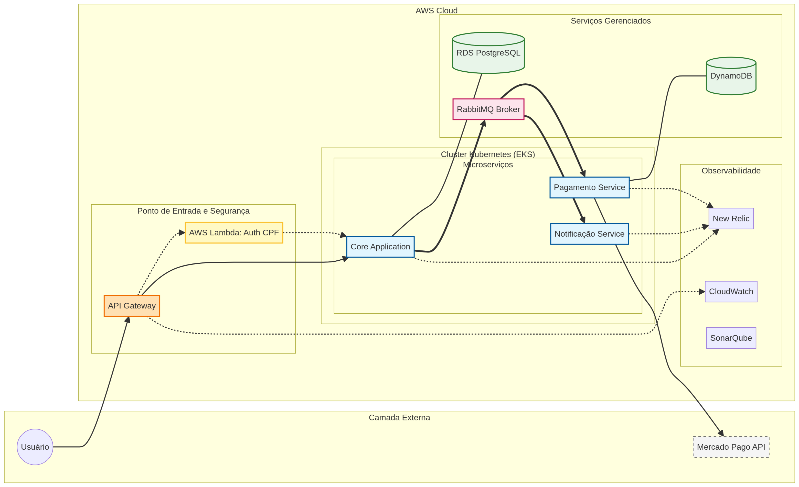
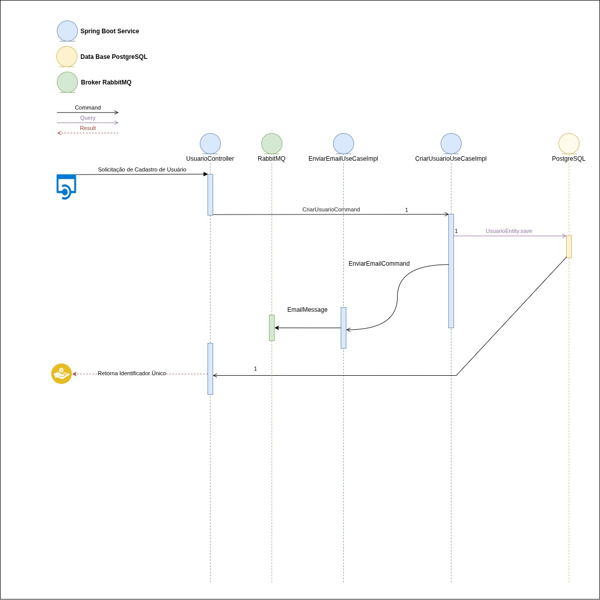
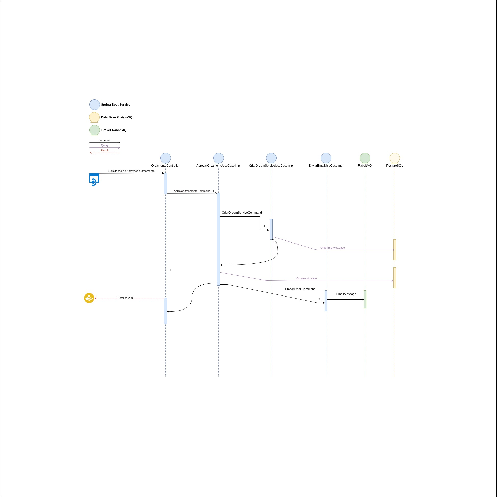
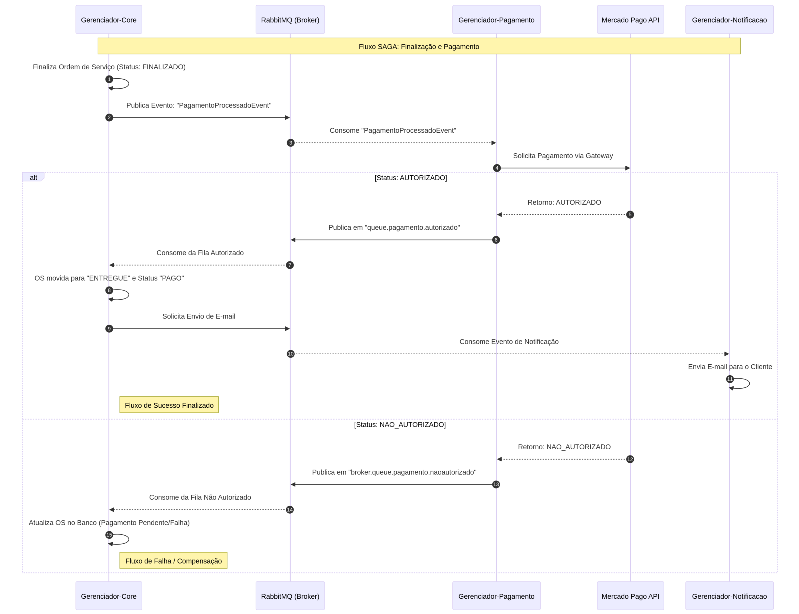

# 🛠 API de Gerenciador de Oficina - Fase 4

[](https://openjdk.org/)
[](https://spring.io/projects/spring-boot)
[](https://www.postgresql.org/)
[](https://www.docker.com/)
[](https://kubernetes.io/)
[](https://aws.amazon.com/eks/)
[](https://github.com/thomaserick/gerenciador-oficina-core-fase-2/actions/workflows/pipeline.yml)
[](https://newrelic.com/)
[](https://sonarcloud.io/dashboard?id=CaioMC_gerenciador-oficina-core)

API para gerenciamento de uma oficina com autenticação e controle de estoque.

## 🔗 Repositórios Relacionados — Fase 4

A arquitetura do **Gerenciador de Oficina — Fase 3** é composta por múltiplos módulos independentes, cada um versionado
em um repositório separado para facilitar a manutenção e o CI/CD.

| Módulo                            | Descrição                                                                                               | Repositório                                                                                                     |
|:----------------------------------|:--------------------------------------------------------------------------------------------------------|:----------------------------------------------------------------------------------------------------------------|
| 🧱 **Core Application**           | Aplicação principal responsável pelas regras de negócio, APIs REST e integração com os demais módulos.  | [gerenciador-oficina-core-fase-4](https://github.com/thomaserick/gerenciador-oficina-core-fase-4)               |
| ⚡ **Lambda Functions**            | Conjunto de funções *serverless* para processamento assíncrono, notificações e automações event-driven. | [gerenciador-oficina-lambda-fase-4](https://github.com/thomaserick/gerenciador-oficina-lambda-fase-4)           |
| ☸️ **Kubernetes Infrastructure**  | Infraestrutura da aplicação no Kubernetes, incluindo manifests, deployments, ingress e autoscaling.     | [gerenciador-oficina-k8s-infra-fase-4](https://github.com/thomaserick/gerenciador-oficina-k8s-infra-fase-4)     |
| 🗄️ **Database Infrastructure**   | Infraestrutura do banco de dados gerenciado (RDS PostgreSQL), versionada e automatizada via Terraform.  | [gerenciador-oficina-db-infra-fase-4](https://github.com/thomaserick/gerenciador-oficina-db-infra-fase-4)       |
| 🌐 **API Gateway Infrastructure** | Infraestrutura do API Gateway com rate limiting, redirecionamento e monitoramento via Terraform.        | [gerenciador-oficina-api-gateway-infra-fase-4](https://github.com/CaioMC/gerenciador-oficina-gateway-fase-3)    |
| ✉️ **Notificação**                | Microserviço responsável pelo envio e gerenciamento de notificações                                     | [gerenciador-oficina-notificacao-fase-4](https://github.com/thomaserick/gerenciador-oficina-notificacao-fase-4) |
| 💲 **Pagamento**                  | Microserviço responsável pelo envio e gerenciamento de Pagamentos                                       | [gerenciador-oficina-pagamento-fase-4](https://github.com/thomaserick/gerenciador-oficina-pagamento-fase-4)     |

> 🔍 Cada repositório é autônomo, mas integra-se ao **Core** por meio de pipelines e configurações declarativas (
> Terraform e CI/CD).

## 📋 Índice

- [Vídeos de Demonstração](#-vídeos-de-demonstração)
- [Tecnologias](#-tecnologias)
- [CI/CD Pipeline](#-cicd-pipeline--github-actions)
- [Kubernetes (EKS)](#-kubernetes-eks)
- [Monitoramento e Observabilidade](#-monitoramento-e-observabilidade-com-new-relic)
- [Instalação Local](#-instalação-local)
- [Instalação Aws](#-instalação-Aws)
- [Autenticação](#-autenticação)
- [Documentação APIs](#-documentação-da-api)
- [Documentação Extra](#-documentação-extra)

### 🎬 Vídeos de Demonstração

### [Desafio - Apresentacao - DOCUMENTAÇÕES](https://www.loom.com/share/4ffb02e6c0964e40ba426e13b0f5d391)

### [Desafio - Apresentacao - Gateway + Lambda](https://www.loom.com/share/9afd356c1c0f4cdca6962e6439420ae9)

### [Desafio - Apresenta - New Relic](https://www.loom.com/share/7b636334eaed4fcbaa8c2627d8be8567)

## 🛠 Tecnologias

- **Java 17+** - Linguagem principal
- **Spring Boot 3.3** - Framework backend
- **Spring Security**
- **JWT**
- **JPA/Hibernate**
- **PostgreSQL** - Banco de dados
- **Docker** - Containerização
- **Flyway** - Migrações de banco
- **OpenAPI/Swagger** - Documentação APIs
- **Mockito** - Testes unitários
- **GitHub Actions** - Automação CI/CD
- **SonarQube** - Análise de qualidade e cobertura de código
- **Terraform** - Gerenciador de Infraestrutura IaC
- **Kubernetes (K8s)** - Deploy e escalonamento
- **AWS EKS** - Orquestração de containers
- **AWS RDS** - Banco de dados gerenciado (PostgreSQL)
- **AWS IAM** - Gerenciamento de permissões e segurança
- **AWS VPC** - Rede privada virtual
- **AWS EC2** - Instâncias de servidores
- **New Relic** - Monitoramento e observabilidade
- **RabbitMQ** - Gerenciamento de Mensageria

## 📝 Diagramas Tecnicos








### 1. Justificativa da Divisão

A arquitetura foi separada para isolar domínios de negócio com características e requisitos operacionais diferentes:

- **Gerenciador-Core**: Concentra a inteligência de negócio da oficina (clientes, veículos, ordens de serviço). É o coração do sistema e possui alta complexidade transacional com o banco de dados relacional (RDS).

- **Gerenciador-Notificacao**: É um serviço de infraestrutura de apoio. Sua única responsabilidade é garantir que a comunicação com o cliente ocorra. Ele não deve impactar o fluxo principal se houver instabilidade em provedores de e-mail.

- **Gerenciador-Pagamento**: Lida com um domínio sensível e crítico: integração financeira. Ao isolá-lo, garantimos que regras de conformidade e integrações externas (Mercado Pago) fiquem restritas a um único componente.

### 2. Benefícios da Abordagem

| Benefício | Descrição |
|-----------|-----------|
| **Escalabilidade Independente** | Se houver um pico de pagamentos ou envio massivo de e-mails, podemos escalar apenas esses serviços no Kubernetes (EKS), sem precisar aumentar os recursos do Core. |
| **Resiliência e Desacoplamento** | Graças ao RabbitMQ, se o serviço de Notificação estiver fora do ar, o Core continua funcionando. As mensagens ficam na fila e são processadas assim que o serviço retornar, sem perda de dados. |
| **Evolução Tecnológica** | Cada serviço pode evoluir de forma independente. O serviço de Pagamento utiliza DynamoDB (NoSQL), que é ideal para logs de transações, enquanto o Core usa PostgreSQL (Relacional) para consistência de dados. |
| **Facilidade de Manutenção** | Times diferentes podem trabalhar em repositórios diferentes sem causar conflitos de código (merge conflicts), acelerando o ciclo de entrega (CI/CD). |
| **Isolamento de Falhas** | Um erro crítico no processamento de um pagamento ou no envio de um e-mail não "derruba" a API principal da oficina, mantendo o sistema disponível para consultas e abertura de ordens. |

> 💡 Essa estrutura transforma um sistema que poderia ser um "monolito frágil" em uma plataforma distribuída, preparada para alta carga e fácil manutenção.

## 🚀 Arquitetura

| Clean Architecture                                  |
|-----------------------------------------------------|
|  |  |

## ⚙️ Fluxo da Infraestrutura


## 🚀 CI/CD Pipeline – GitHub Actions

Esta pipeline automatiza o processo de build, teste, análise, empacotamento e deploy da aplicação Gerenciador Oficina
Core.
Ela é executada automaticamente em eventos de push na branch main.


### Variaveis de Ambiente

A pipeline utiliza as seguintes variáveis de ambiente armazenadas como Secrets no GitHub:

| Nome                  | Descrição                                        |
|-----------------------|--------------------------------------------------|
| SONAR_TOKEN           | Token de autenticação para o SonarQube           |
| DOCKERHUB_USERNAME    | Nome de usuário do Docker Hub                    |
| DOCKERHUB_TOKEN       | Token de acesso do Docker Hub                    |
| AWS_ACCESS_KEY_ID     | Chave de acesso AWS                              |
| AWS_SECRET_ACCESS_KEY | Chave secreta AWS                                |
| NEW_RELIC_LICENSE_KEY | Chave de licença do New Relic para monitoramento |

### 🔨 Job: Build

Responsável por compilar o projeto e gerar o artefato `.jar`.

- Faz checkout do código fonte.
- Executa em um container Ubuntu com Java 17 e Maven pré-instalados.
- Executa o comando: - mvn -B clean package -DskipTests
- Faz upload do artefato gerado `(target/*.jar)` para ser reutilizado nos próximos jobs.

### ✅ Job: test

Executa os testes unitários:

- Faz checkout do código.
- Configura o Java 17.
- Executa `mvn test` para validar o código antes de seguir.

### 🔍 Job: SonarQube Analysis

Realiza a análise estática de código com o SonarQube:

- Faz checkout e configuração Java.
- Utiliza cache do SonarQube para otimizar execução.
- Executa:`
mvn -B verify org.sonarsource.scanner.maven:sonar-maven-plugin:sonar \
Dsonar.projectKey=CaioMC_gerenciador-oficina-core
`
- Autenticação via SONAR_TOKEN armazenado nos GitHub Secrets.

### 🐳 Job: docker

Cria e publica a imagem Docker da aplicação:

- Faz download do artefato .jar gerado no job Build.
- Faz login no Docker Hub usando secrets (DOCKERHUB_USERNAME e DOCKERHUB_TOKEN).
- Configura o ambiente Docker Buildx.
- Constrói e envia a imagem para o Docker Hub com as tags:
    - latest
    - run_number (versão incremental da execução da pipeline)
- Publica em: `docker.io/<usuario-dockerhub>/gerenciador-oficina-core`

### ☁️ Job: aws-deploy

Realiza o deploy automático no AWS EKS:

- Configura credenciais da AWS `(via AWS_ACCESS_KEY_ID_DEV e AWS_SECRET_ACCESS_KEY_DEV)`.
- Instala e configura o kubectl.
- Atualiza o kubeconfig para o cluster EKS
- Obtém automaticamente o endpoint do banco RDS e substitui no `ConfigMap`
- Executa o script `./devops/scripts/deploy-prod-k8s.sh
` para aplicar as configurações Kubernetes.

## ☸️ Kubernetes (EKS)

A pasta devops/k8s/prod contém os manifestos Kubernetes utilizados para implantar e gerenciar a aplicação no cluster
EKS (AWS).
Cada arquivo tem uma função específica dentro do fluxo de deploy e operação em produção.

### 📁 Estrutura

```plaintext
devops/
├─ k8s/
│   └─ prod/
│       ├─ configmap.yaml
│       ├─ deployment.yaml
│       ├─ hpa.yaml
│       ├─ namespace.yaml  
│       ├─ service.yaml
│       ├─ postgres-secret.yaml
│       └─ services.yaml
└─ scripts/
    └─ deploy-prod-k8s.sh
```

| Arquivo                  | Descrição                                                                                                                                                                                                  |
|--------------------------|------------------------------------------------------------------------------------------------------------------------------------------------------------------------------------------------------------|
| **namespace.yaml**       | Define o namespace onde os recursos da aplicação serão criados (isola o ambiente no cluster).                                                                                                              |
| **configmap.yaml**       | Contém variáveis de configuração da aplicação, incluindo o endpoint do RDS                                                                                                                                 |
| **postgres-secret.yaml** | Armazena de forma segura as credenciais de acesso ao banco de dados PostgreSQL (usuário e senha).                                                                                                          |
| **deployment.yaml**      | Define como o container da aplicação é executado — imagem Docker, réplicas, volumes e variáveis de ambiente.                                                                                               |
| **services.yaml**        | Expõe o deployment internamente ou externamente via LoadBalancer, tornando a aplicação acessível.                                                                                                          |
| **hpa.yaml**             | Configura o **Horizontal Pod Autoscaler**, responsável por escalar os pods automaticamente conforme CPU/memória.                                                                                           |
| **deploy-prod-k8s.sh**   | Script automatizado utilizado no pipeline de CI/CD para aplicar todos os manifests ( `kubectl apply -f`) no cluster EKS. Também atualiza o `ConfigMap` com o endpoint mais recente do RDS antes do deploy. |

## 📊 Monitoramento e Observabilidade com New Relic

Este projeto utiliza o New Relic para garantir observabilidade completa da aplicação, permitindo monitorar performance,
saúde, consumo de recursos e falhas operacionais em tempo real.

### Visão Geral (APM)


### Latência das APIs


### Consumo de Recursos


### Logs Estruturados e Correlação


### Alertas


### Synthetic monitors


### 🔍 Monitoramento

A solução contempla o acompanhamento contínuo dos seguintes aspectos:

- Latência das APIs
    - Tempo de resposta das requisições HTTP.
    - Identificação de endpoints mais lentos.
    - Análise de throughput e apdex.

- Consumo de recursos no Kubernetes
    - Uso de CPU e memória por pod e container.
    - Análise de comportamento sob carga.
    - Detecção de gargalos

- Healthchecks e Uptime
    - Monitoramento dos endpoints:
        - /actuator/health
        - /actuator/health/liveness
        - /actuator/health/readiness
    - Integração com probes do Kubernetes.
    - Validação contínua de disponibilidade da aplicação.
    -
- Alertas para falhas no processamento de ordens de serviço
    - Alertas baseados em erros de negócio.
    - Monitoramento de falhas por status da ordem de serviço.
    - Notificações automáticas em caso de degradação ou erro crítico.

- Logs estruturados (JSON)
    - Logs no formato JSON para melhor indexação e busca.
    - Correlação entre logs, traces e requisições.
    - Inclusão de trace.id, span.id e identificadores de negócio (ex: ordemServicoId).

### 📈 Dashboards

São disponibilizados dashboards no New Relic para visualização e análise dos principais indicadores do sistema:

### Dashboards


- Volume diário de ordens de serviço
    - Total de ordens criadas por dia.
- Tempo médio de execução por status
    - Diagnóstico
    - Execução
    - Finalização

  Permite identificar gargalos no fluxo de processamento.

- Erros e falhas nas integrações
    - Erros em chamadas externas.
    - Taxa de falhas por integração.
    - Análise de impacto no fluxo de negócio.

### 🚨 Alertas

Alertas são configurados no New Relic para:

- Aumento anormal de latência.
- Erros HTTP (4xx / 5xx).
- Falhas no processamento de ordens de serviço.
- Indisponibilidade dos healthchecks.
- Consumo excessivo de CPU ou memória no Kubernetes.

## ⚙️ Instalação Local

### Rodar o projeto local com Docker

#### Pré-requisitos

- Docker 24.0+
- Docker Compose 2.20+

#### Comandos

1. Suba os containers:

```bash
  docker-compose up 
```

### Rodar o projeto local com Kubernetes

#### Pré-requisitos

- Docker 24.0+
- Suba o Kubernetes localmente (minikube, kind, etc)

#### Comandos

1. Aplique os manifests manualmente ou utilize o comando abaixo para aplicar todos os manifests da pasta k8s

```bash
  ./devops/scripts/deploy-dev-k8s.sh
```

2. Verifique se os pods estão rodando

```bash
  kubectl get pods -n gerenciador-oficina-core
```

3. Caso utilize o Kind precisa criar um port-forward para acessar a aplicação
   (não expõe automaticamente os NodePorts para o localhost)

```bash
  kubectl port-forward service/gerenciador-oficina-service 8081:8081 -n gerenciador-oficina-core
```

5. Acesse a aplicação na porta `http://localhost:8081/swagger-ui/index.html` ou
   `http://localhost:30081/swagger-ui/index.html`

### Rodar o projeto local

#### Pré-requisitos

- **Java** 17+
- **PostgreSQL** para banco de dados
- **Maven** para gerenciar as dependências do projeto

#### Comandos

1. Clone o repositório

   SSH

    ```
    git@github.com:CaioMC/gerenciador-oficina-core.git
    ```
   Http
    ```
    https://github.com/CaioMC/gerenciador-oficina-core.git
    ```
2. Configure o Banco de Dados
   ```
    psql -U postgres
    CREATE DATABASE gerenciador-oficina;
   ```
3. Configura o profile como `dev`

    ```
    spring.profiles.active=dev
    ```
4. Adicionar o agent do newrelic na execução da aplicação

    ```
    -javaagent:pathCompleto/gerenciador-oficina-core-fase-3/newrelic/newrelic.jar
    ```
5. Configurar a key do newRelic ${NEW_RELIC_LICENSE_KEY} nas variaveis de ambiente da aplicação

O sistema rodará na porta `localhost:8081`.

## ⚙️ Instalação AWS

#### Pré-requisitos

- Docker 24.0+
- Terraform v1.13+
- AWS CLI v2+
- Kubectl v1.27+

Para subirmos todo o seviço na AWS para gerenciar nossa aplicação, precisamos executar alguns
passos para primeiro subir toda nossa infraestrura para AWS e depois executar
o CI/CD pelo github Actions pra fazer o deploy da aplicação.

### Rodar o projeto AWS

#### Comandos

1. Crie um usuario na AWS que contenha a policy AdministratorAccess
2. Gere as Secrets AWS-ACCESS-KEY-ID e AWS-SECRET-ACCESS-KEY (Guarde em um local seguro)
3. Autenticar o usuario pelo AWS CLI

  ```
    aws configure
    
    Ex: AWS 
      Access Key ID [****************2VXT]: 
      AWS Secret Access Key [****************B9uz]: 
      Default region name [us-east-1]: 
      Default output format [json]:
  ```

4. Rodaremos o commando para subir toda nossa infraestrutura no servidor da `AWS EKS` para orquestação de containers
   e RDS `postgres` para banco de dados relacional
    1. Abra um terminal na pasta ./infra/terraform/prod para inicializar o terraform
        ```
        terraform init   
        ```
    2. Para de fato subir precisamos rodar o commando
        ```
        terraform apply
        ```
    3. Se tudo der certo vai subir 38 recursos na Aws de infra da nossa aplicação
    4. Caso queira derrubar toda a infraestrura
        ```
        terraform destroy
        ```
5. Depois que toda infraestrutura estiver UP vamos para o proximo passo que é o deploy da aplicação
6. Utilizamos o gitHub Actions onde é feito automaticamente o deploy da aplição para a nossa infra na AWS

## 🔑 Autenticação

### Endpoints Públicos

- `/usuarios` (POST)
- `/usuarios/login`

Você precisará se autenticar no endpoint `/usuarios/login`, caso não tenha usuário cadastado
utilizar o endpoint `/usuarios`.

```
{
  "nome": "Severino",
  "sobreNome": "da silva",
  "email": "severino@fiap.com.br",
  "senha": "Fiap@1234",
  "ativo": true,
  "perfis": [
    "ADM"
  ]
}

```

## 📚 Documentação da API

### [▶️ Swagger](http://localhost:8081/swagger-ui/index.html)

## 📚 Documentação Extra

### [▶️ EventStorming](https://miro.com/app/board/uXjVIhTYiq8=/?share_link_id=963111040580)

### [▶️ Diagrama](https://drive.google.com/file/d/1gpGtB9AUglij6xUx8oZw5JVPN-rvoWDh/view)

### [▶️ Imagem no Docker-Hub](https://hub.docker.com/r/thomaserick/gerenciador-oficina-core)

### [▶️ ADR-Documentation](docs/assets/ADR-Documentation.pdf)

### [▶️ BDD-Documentation](docs/assets/BDD-Documentation.pdf)

